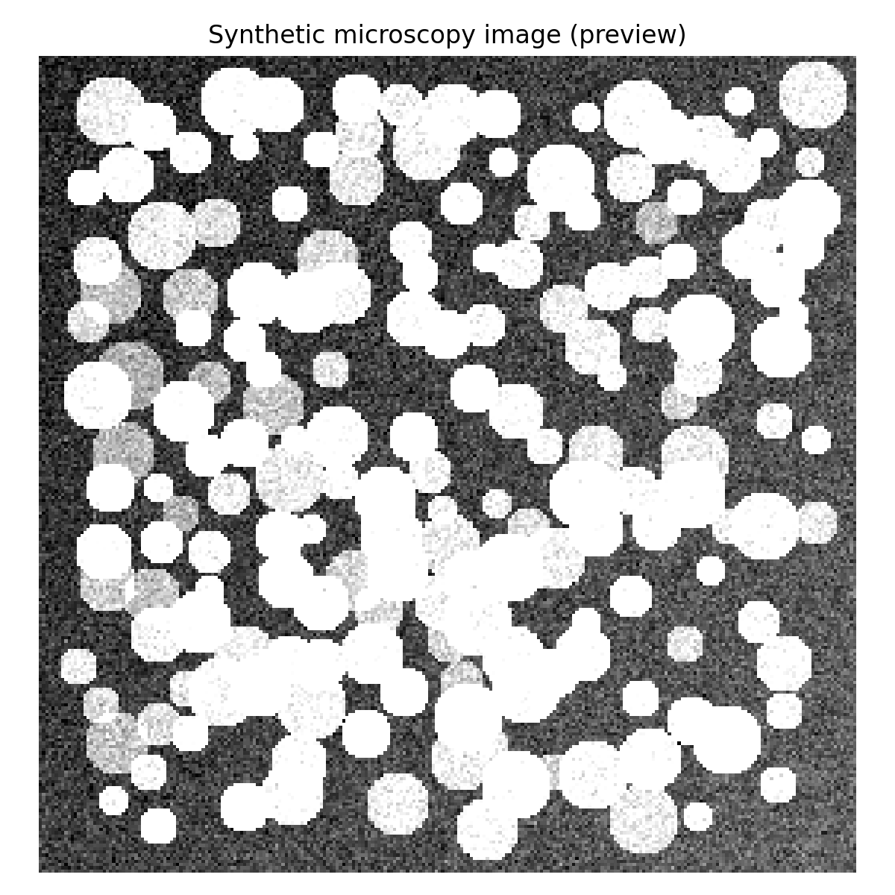
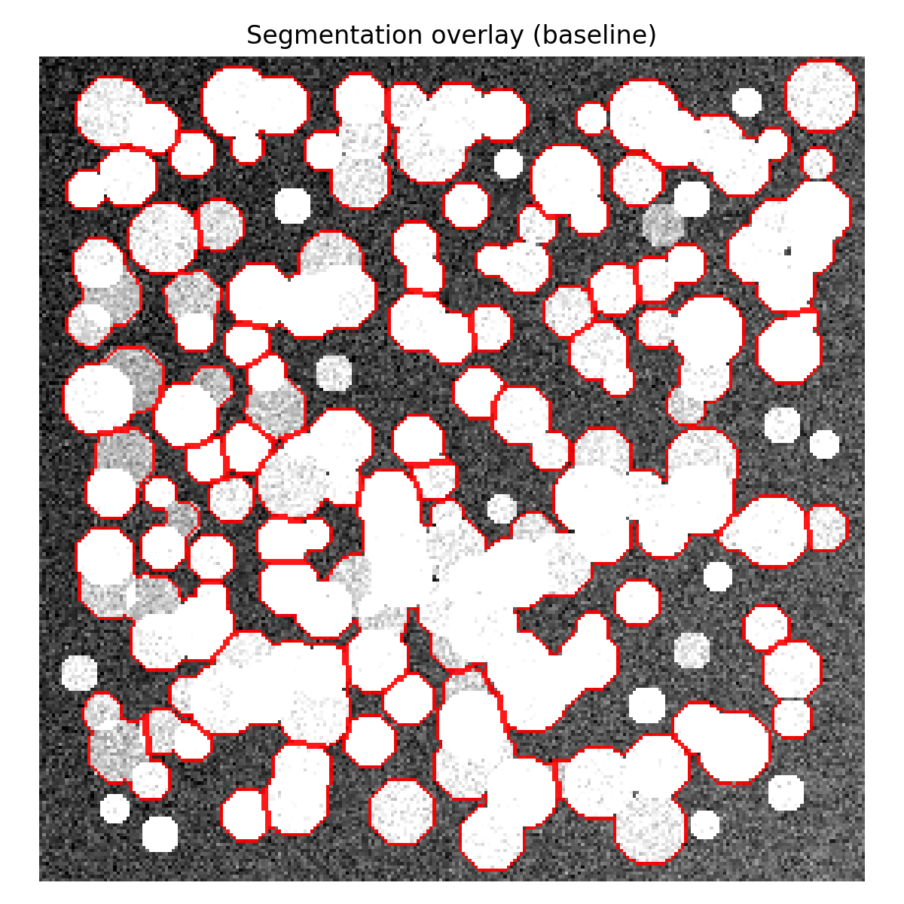
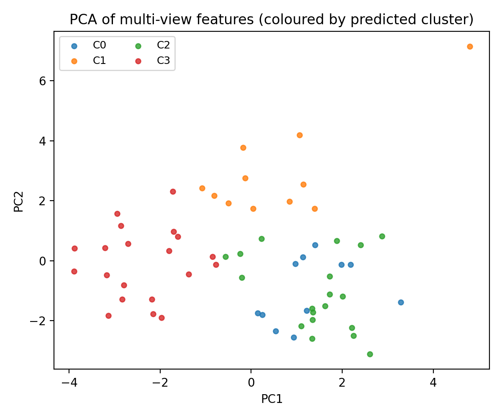
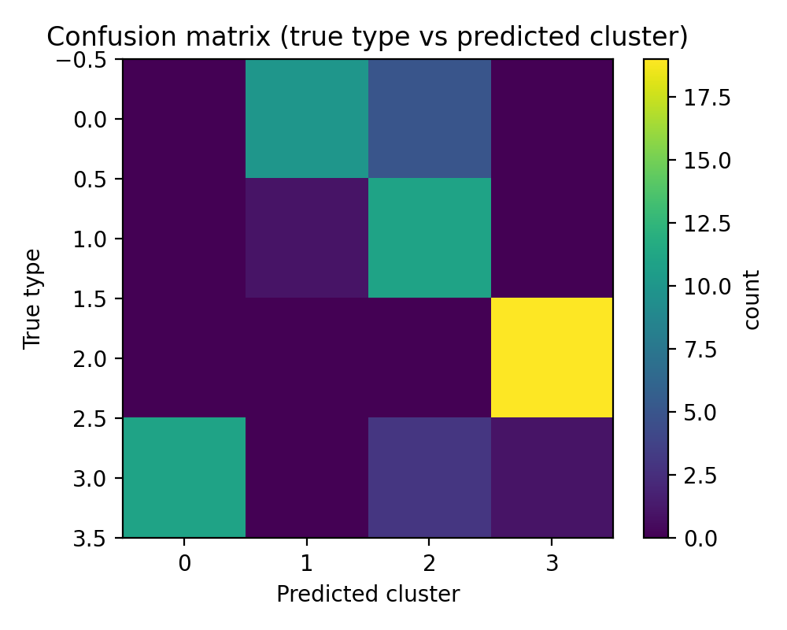

# Figures — Results Summary (Microscopy Segmentation + Multi-view Probabilistic Clustering)

This folder contains the main visual outputs of the pipeline. Together, these figures demonstrate:
1) the quality of baseline segmentation,  
2) how the fused multi-view features organise cells in latent space, and  
3) how predicted clusters relate to the synthetic “true” cell types.

---

## 1) Synthetic microscopy preview — `synthetic_image_preview.png`

**What it shows:** A generated microscopy-like image used for the analysis (shareable, no real patient/lab data).  
**Why it matters:** It provides a realistic testbed for segmentation and downstream feature extraction under controlled conditions.

---

## 2) Segmentation overlay — `segmentation_overlay.png`

**What it shows:** Segmentation boundaries (Otsu + watershed) overlaid on the image.  
**Why it matters:** This is the first critical step in microscopy pipelines; segmentation quality directly affects feature extraction and clustering.

---

## 3) PCA projection coloured by predicted cluster — `pca_clusters.png`

**What it shows:** A 2D PCA projection of the **combined multi-view features** (morphology/intensity + barcode/projection view), coloured by predicted cluster.  
**Why it matters:** It provides an interpretable sanity check: clusters should separate meaningfully if the fused views carry signal.

---

## 4) Confusion matrix (true type vs predicted cluster) — `confusion_matrix.png`

**What it shows:** How predicted clusters align with the synthetic “true” cell types.  
**Why it matters:** Even though clustering is unsupervised, this matrix indicates whether the model is recovering biologically meaningful groupings (in this demo, “true types”).

---

### Where to find headline metrics
See `reports/metrics.json` for segmentation overlap metrics (Dice/IoU) and clustering quality (ARI) + uncertainty summaries.
