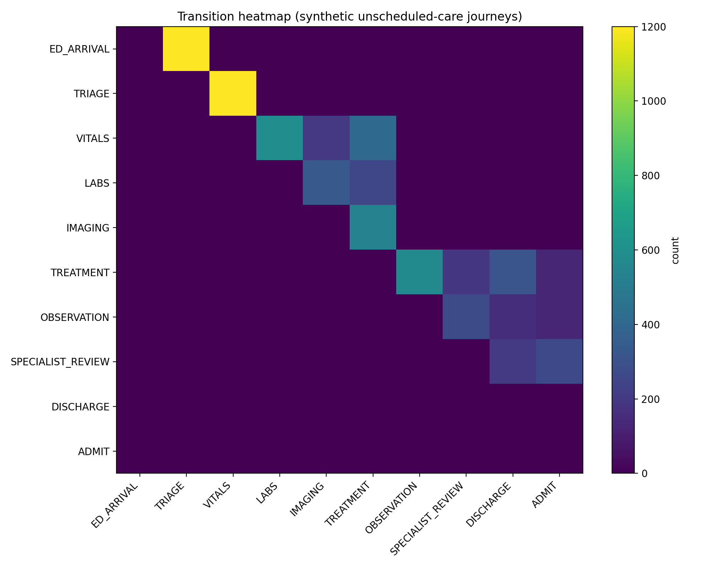
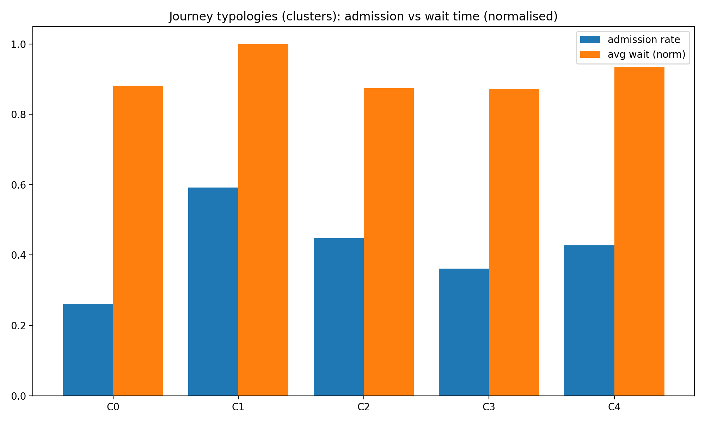
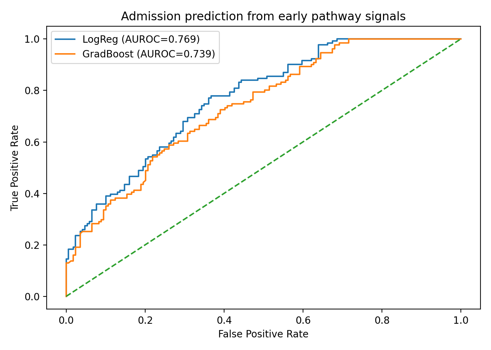
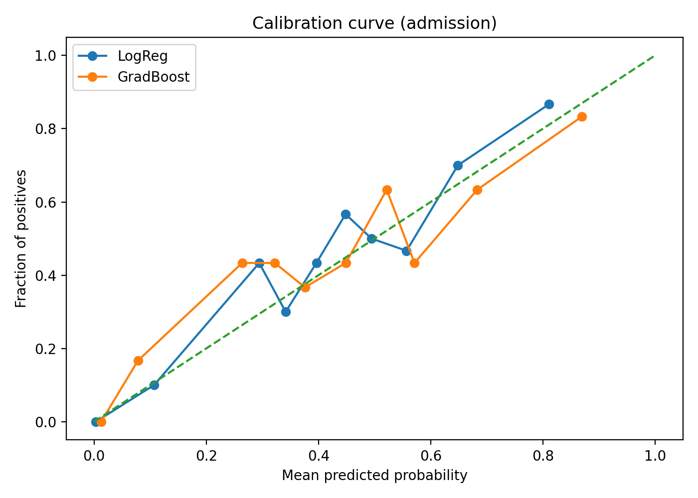

# Figures — Results Summary (Patient Journey Analytics: Unscheduled Care)

This folder contains the key outputs produced by the pipeline. Together, these figures show:
1) how patient journeys move through services,  
2) whether there are recurring “journey types”, and  
3) how well early-pathway signals can predict admission risk.

---

## 1) Transition heatmap — `transition_heatmap.png`

**What it shows:** A matrix of how frequently patients move from one step/service to the next (e.g., **TRIAGE → VITALS**, **VITALS → LABS**).  
**Why it matters:** It highlights the dominant pathway “traffic”, making it easier to identify high-volume transitions and potential bottlenecks.

---

## 2) Journey typologies — `cluster_profiles.png`

**What it shows:** Cluster-level journey profiles comparing **admission rate** and **average waiting time (normalised)** across discovered journey clusters.  
**Why it matters:** Clusters act like practical “journey types” (e.g., short discharge pathways vs more complex pathways with higher admission likelihood).

---

## 3) Admission prediction (discrimination) — `roc_admission.png`

**What it shows:** ROC curves for two baseline models (Logistic Regression and Gradient Boosting) predicting admission from early pathway signals.  
**Why it matters:** Demonstrates whether early journey information provides meaningful predictive signal (AUROC in legend).

---

## 4) Admission prediction (trustworthiness) — `calibration_admission.png`

**What it shows:** Calibration curves comparing predicted admission probabilities to observed admission rates.  
**Why it matters:** In healthcare and operational decision-making, probabilities must be reliable—not just accurate. A well-calibrated model supports safer decisions.

---

### Related artefacts (outside this folder)
- `reports/metrics.json` — AUROC, Brier score, and an ECE-style calibration summary
- `reports/sankey_pathways.html` — interactive flow diagram of the most common pathways
